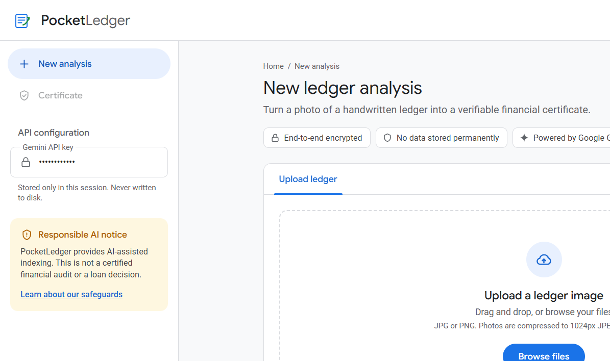
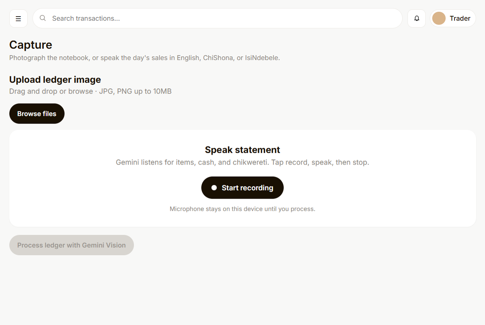
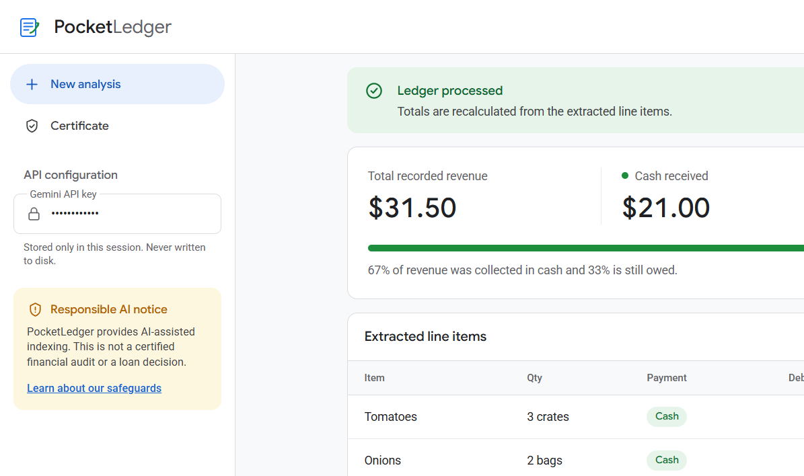
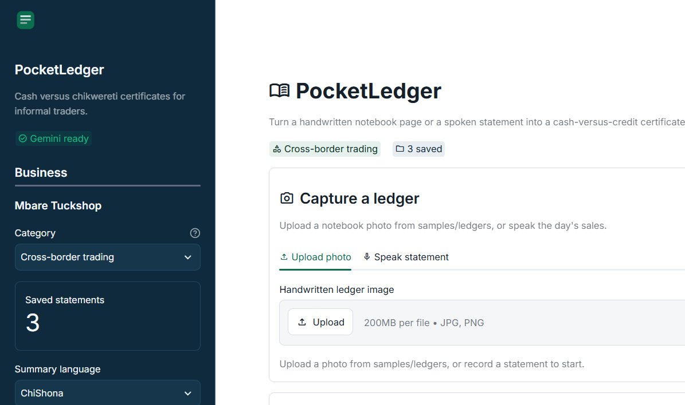

# PocketLedger — AI financial certificate for informal traders

Built for **Hack for Humanity Harare 2026** (challenge: Best Use of the Google Gemini API).

Informal traders keep daily sales and *chikwereti* (customer credit) in paper notebooks. That makes it hard to prove cash flow for a micro-loan. PocketLedger uses Gemini Vision (`gemini-3.6-flash`) to read a handwritten page or a spoken statement, split cash versus credit, and produce a structured micro-business financial health certificate.

## Demo

[Live demo](https://fabber04.github.io/czi-hackathon/) — GitHub Pages redirects to the Streamlit app. Deploy `app.py` on [Streamlit Community Cloud](https://share.streamlit.io/deploy?repository=fabber04/czi-hackathon&branch=main&mainModule=app.py) (suggested URL: `https://czi-hackathon.streamlit.app`). Add `GEMINI_API_KEY` in Streamlit secrets. If your app URL is different, set the repo variable `STREAMLIT_APP_URL`.

**1. Capture.** Photograph a notebook page or dictate the day’s sales in English, ChiShona, or IsiNdebele.

**2. Extract.** Gemini returns JSON line items. The app recalculates revenue, cash, outstanding credit, and expenses (rent is not counted as sales).

**3. Certificate.** The Streamlit app keeps a trader profile, language toggle, and a simple 7-day projection from saved pages.

Sample notebook images for the demo live in `samples/ledgers/`.

## Specification

See [`SPEC.md`](SPEC.md) for the product and technical spec, including the planned **Business Health Score** (based on research into how Moniepoint assesses merchants) and its acceptance criteria.

> This copy lives in the `pocketledger/` folder of `Khankindle/Khankindle`. Run the commands below from inside `pocketledger/`. The GitHub Pages workflow in `pocketledger/.github/` only runs from the original `fabber04/czi-hackathon` repository.

## Gemini integration and tech stack

- **Multimodal vision and audio:** Reads non-standard notebook layouts and spoken market language.
- **Structured outputs:** Converts the page or recording into JSON the app can verify, display, and export as PDF.
- **Stack:** Python, Streamlit, `google-genai` SDK, Pandas, Pillow, fpdf2.

## Run locally

1. `python -m venv .venv`
2. `.venv\Scripts\activate`
3. `pip install -r requirements.txt`
4. Copy `.env.example` to `.env` and add `GEMINI_API_KEY`
5. `streamlit run app.py`

Run the unit tests (no API key needed): `pip install -r requirements-dev.txt` then `pytest`. They cover the health score engine (`health_score.py`) and totals in `ledger_core.py`.

Before a demo, or after changing the Gemini prompt, run `python test_gemini.py`. It checks that the API key works, a model answers, and the reply parses as JSON.

## Android

The phone app is in `mobile/`. It photographs a notebook and sends the picture to this computer, which calls Gemini. The API key stays in `.env`.

1. `python extract_server.py` (listens on port 8765 for the phone)
2. `cd mobile` then `flutter run`, or `flutter build apk`
3. On an emulator the API address is `http://10.0.2.2:8765`. On a phone, use the laptop's Wi-Fi address, for example `http://192.168.100.100:8765`.

## Safeguards and limitations

PocketLedger is AI-assisted indexing for micro-finance evaluation. It is not an IT audit, tax audit, or certified financial report, and it is not a loan decision. Images and recordings are processed in the session and are not stored permanently.

## Hack Day build boundary

**Built today:** Streamlit UI, Gemini Vision and audio prompts, JSON parser, cash-versus-credit dashboard, 503 handling, PDF certificate, and a demo sample ledger generator.
